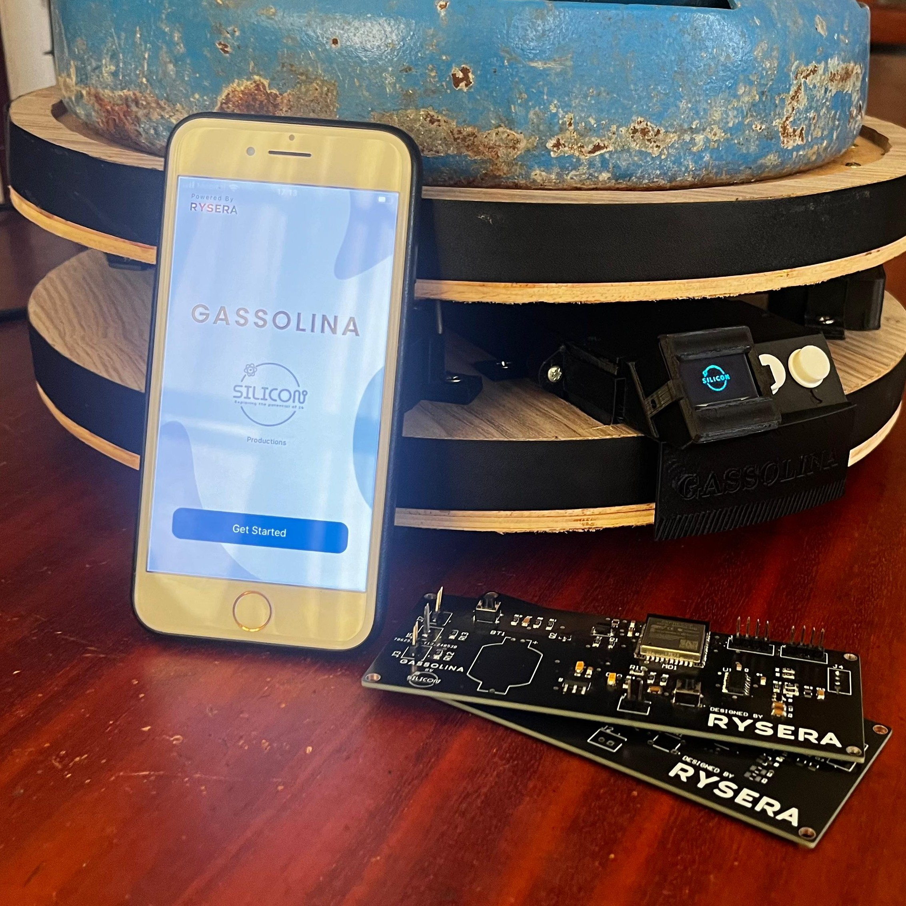
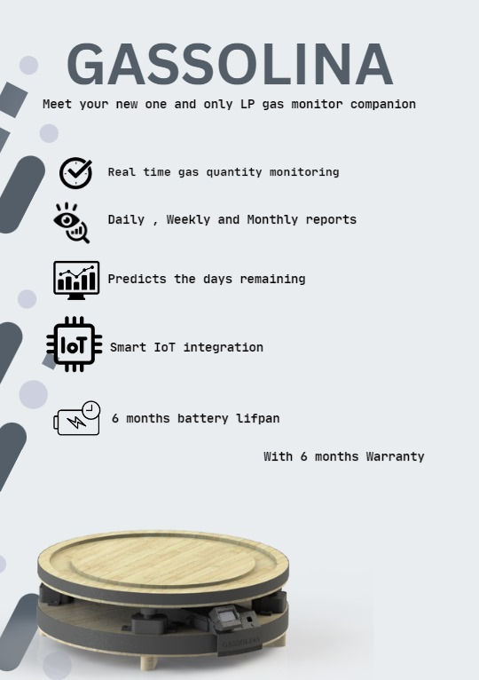
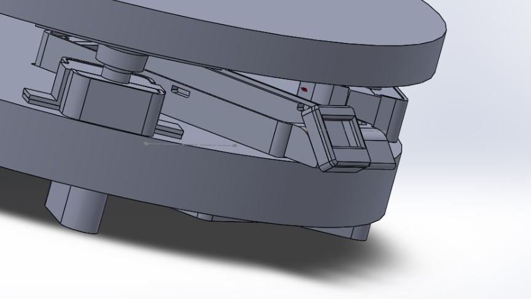
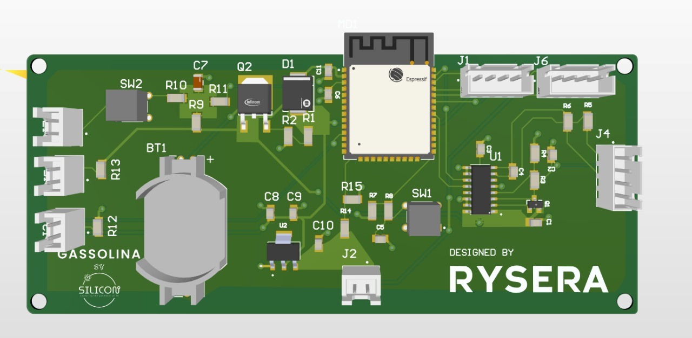

# 🔥 Gassolina

**Gassolina** is an IoT-based domestic LPG gas level monitoring system that provides real-time insights, intelligent usage prediction, and detailed analytics. It includes a smart embedded device and a companion mobile app, allowing users to track gas levels, receive low-level alerts, and view consumption reports for better planning and safety.

---

## 🧩 Project Overview

Developed by a team of four under the name **Silicon**, the project integrates embedded systems, mobile technology, and cloud-based analytics to offer a seamless user experience.

The system consists of:

- A custom-designed embedded device with ultra-low power operation  
- A purpose-built enclosure that fits neatly where the gas tank is placed  
- A mobile application for setup, configuration, and analytics  
- Firebase as the real-time backend

### 🔧 Hardware Highlights
- Custom PCB and enclosure designed for practical use and aesthetics  
- Battery-powered embedded device with over **6 months** of runtime on a single set of batteries  
- **Wi-Fi + BLE** connectivity for versatile remote access and local configuration  
- Power-efficient design optimized for long-term use in home environments

### 📱 Software & App Features
- Intuitive mobile app for:
  - Initial setup and device pairing  
  - Real-time gas level monitoring  
  - Custom configuration of device parameters  
  - Analytics dashboard with predictions and usage history  
- Support for monitoring multiple devices from a single app  
- Anywhere, anytime access to your LPG gas status

### 📊 Smart Features
- Intelligent prediction of gas usage and refill cycles  
- Historical data analytics and trend visualization  
- Alerts and notifications for low levels or unusual usage patterns

### ✨ Design & Vision
- Enclosure design matches modern kitchen aesthetics  
- Built with a focus on **usability**, **power efficiency**, and **visual appeal**  
- A comprehensive **market and business analysis** was conducted prior to development to validate real-world needs and feasibility

  
  
  
  

---

## 🧰 Tech Stack & Tools

### 📱 Mobile App
  
  

### 🔌 Embedded System
  
  

### 🛠️ Hardware & Design
  

### 🧑‍💻 Development Tools
  

---

## 📂 Related Repositories

This project is divided into multiple focused repositories for better modularity and development workflow:

- 🔗 [**Gassolina – Mobile App**](https://github.com/silveradium/Gassolina)  
  Cross-platform mobile app built with React Native and Firebase. Handles user interface, configuration, analytics, and device setup.

- 🔗 [**Gassolina – Embedded Firmware**](https://github.com/Rakindu-L/gasolina)  
  Battery-efficient firmware for the ESP32-based embedded device. Includes gas level sensing, Wi-Fi/BLE communication, and power management.

- 🔗 [**Gassolina – PCB Design**](https://github.com/your-username/gassolina-pcb)  
  Custom PCB schematics and layout designed using Altium Designer.

- 🔗 [**Gassolina – Enclosure CAD**]([https://github.com/your-username/gassolina-cad](https://github.com/Rakindu-L/gasolina/blob/8ebff9b88a1b50071cc48fce722510fe2ec71905/images/Final%20View%202.jpeg))  
  3D enclosure and hardware mount designs modeled in SolidWorks to fit standard LPG tanks and modern kitchen environments.

---

## 👥 Contributors

| Name                | GitHub                                              | Contributions                                                                                           |
|----------------------------------|-----------------------------------------------------|--------------------------------------------------------------------------------------------------|
| **Agrajith Pavithra**| [@Agrajith](https://github.com/AgraPWeragoda) | makarket reseach, enclosure design and manufacture.                                             |
| **Agra Navarathne**| [@Agra](https://github.com/github-handle) | Mobile app UI design and development using Figma, React and Firebase.                                                 |
| **Rakindu Luchitha**| [@rakindu](https://github.com/rakindu)              | Embedded system design & implemetation, and cloud integration. system circuitry Design.|
| **Rivikula Fernando**| [@Rivikula](https://github.com/github-handle) | PCB design and layout, schematic design, and testing.                                                            |
